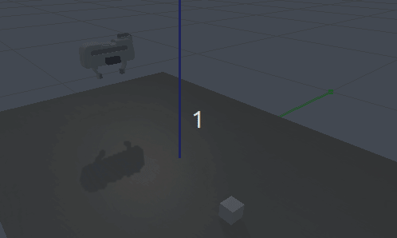

# Learning to grasp using Deep Reinforcement Learning (DRL)

This project demonstrates a Deep Reinforcement Learning (DRL) agent trained to grasp objects in a simulated environment using [PyBullet](https://pybullet.org/) and [Stable Baselines3 (SB3)](https://stable-baselines3.readthedocs.io/).

The agent learns to control a robotic gripper in a simulation and performs grasping tasks utilizing the PPO algorithm. 
The project is designed as a simple demonstration which is ideal for educational purposes or as a starting point for more advanced robotic manipulation tasks.

<div align="center">
  
</div>

### How to Run the RL Grasp Project


1. Build the Docker image: ```bash docker build -t rl_grasp_gym . ```

2. Run the Docker container: ```bash docker run -it --rm rl_grasp_gym```
4. Inside the Docker container, activate the Conda environment: ```bash conda activate grasp_gym```
5. Run agent: ```bash python agent.py --action run ```


